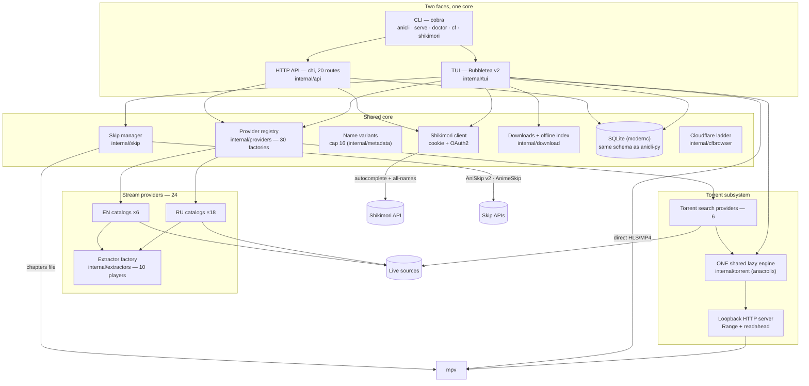

# 📺 AniCLI-Go

<div align="center">

**Terminal anime media center**

A Go port of `anicli-py`: search 30 live sources, stream or download through mpv, sync
progress with Shikimori, and skip openings automatically — one static binary with a TUI
and an HTTP API sharing the same core.

[](https://go.dev/)
[](https://github.com/charmbracelet/bubbletea)
[](https://github.com/charmbracelet/lipgloss)
[](https://github.com/anacrolix/torrent)
[](https://gitlab.com/cznic/sqlite)
[](https://mpv.io/)

[](https://github.com/go-chi/chi)
[](https://github.com/spf13/cobra)
[](https://github.com/bogdanfinn/tls-client)
[](https://github.com/chromedp/chromedp)
[](https://goreleaser.com/)
[](https://github.com/GoogleContainerTools/distroless)
[](Makefile)
[](LICENSE)

[Architecture](#-system-architecture) · [Quick Start](#-quick-start) · [Provider Roster](#-provider-roster) · [Configuration](#-configuration) · [Testing](#-testing)

</div>

---

## 📑 Table of Contents

- [System Architecture](#-system-architecture)
- [Project Structure](#-project-structure)
- [Core Modules](#-core-modules)
- [Search Pipeline](#-search-pipeline)
- [Providers](#-providers)
- [Torrent Engine](#-torrent-engine)
- [Player & Skips](#-player--skips)
- [API Surface](#-api-surface)
- [Configuration](#-configuration)
- [Security](#-security)
- [Quick Start](#-quick-start)
- [Local Development](#-local-development)
- [Testing](#-testing)
- [Provider Roster](#-provider-roster)
- [License](#-license)

---

## 🗺️ System Architecture



Request flow:

1. A query enters through the TUI search screen or `GET /api/v1/search`.
2. With Shikimori enabled the query is enriched: autocomplete → the top-ranked card →
   every name on the card (russian, original, english[], japanese[], synonyms[]) plus
   metadata aliases → a variant pool capped at 16, original query first.
3. Variants route by provider content language (ru → Cyrillic index, ja/en → Latin) and
   fan out to all registered providers with bounded parallelism and a 30 s per-provider
   budget.
4. Failures stay local: a timed-out, geo-blocked, or captcha-walled provider degrades
   only its own row — results from healthy providers still surface.
5. Cross-source duplicates merge into one group; picking a group hydrates the
   episode × dub matrix and binds the title to Shikimori.
6. Playing resolves streams fresh on every launch (resolve caching is forbidden),
   unboxes player embeds through the extractor factory, and launches mpv with the
   source's headers; the skip manager writes FFMETADATA chapters.
7. Torrent results ride the single shared engine: metadata arrives via trackers or DHT,
   and playback streams over a loopback HTTP server into the same mpv path.

---

## 📂 Project Structure

```text
anicli-go/
├── cmd/
│   ├── anicli/                single binary entry point (cobra root)
│   └── parity/                live provider probe + G1 gate + smoke
├── internal/
│   ├── api/                   HTTP API face — chi, 20 routes, token auth
│   ├── buffered/              sequential playback buffering
│   ├── cfbrowser/             stealth-Chromium Cloudflare challenge ladder
│   ├── cli/                   cobra command tree (serve, doctor, cf, shikimori)
│   ├── config/                settings.toml loading + env overrides
│   ├── contracts/             provider/episode/stream interfaces
│   ├── crypto/                AES-CBC + HMAC token primitives
│   ├── download/              bounded background downloader + offline index
│   ├── extractors/            10 player extractors (kodik, sibnet, blogger, …)
│   ├── loadtest/              SLO load suite (build tag `load`)
│   ├── metadata/              alias aggregation + query variants (cap 16)
│   ├── netclient/             tls-client wrapper — fingerprint, proxy, watchdog
│   ├── player/                mpv argv builder + process lifecycle
│   ├── providers/             30 source providers + registry + TorrentBase
│   ├── regression/            API contract golden files (all 20 endpoints)
│   ├── rules/                 dub-stream filter rules
│   ├── shikimori/             Shikimori API client (cookie + OAuth2)
│   ├── skip/                  AniSkip v2 / AnimeSkip / IntroSkipper
│   ├── storage/               SQLite repositories (pure-Go driver)
│   ├── torrent/               shared engine wrapper + loopback stream server
│   └── tui/                   Bubbletea v2 screens
├── settings.example.toml      fully commented settings template
├── Dockerfile                 distroless runtime image
├── .goreleaser.yaml           5-target release matrix (CGO off)
├── THIRD-PARTY-NOTICES.md     dependency license inventory
└── .sdd/ledger.md             build history — PRs, protocol dossiers, rulings
```

---

## 🧩 Core Modules

| Module | Purpose | Key details |
| :-- | :-- | :-- |
| `tui` | Terminal face — session state machine | root menu → lists / downloads / DB / health screens, live search settle counter |
| `api` | HTTP face — 20 routes under `/api/v1` | HMAC-signed access tokens, pbkdf2 users, `X-Trace-Id` correlation |
| `providers` | Source registry — 30 factories in pinned order | one `tls-client` per provider (own cookie jar, tagged errors), `SearchDelegator` stats |
| `extractors` | Player embeds → direct streams | kodik, sibnet, aniboom, alloha, aksor, dood, gogoplay, streamtape, blogger, cdnvideohub |
| `torrent` | BitTorrent streaming | anacrolix engine wrapper, multilink ingest, loopback HTTP with `Range` |
| `shikimori` | Tracker sync | cookie + OAuth2 (auto-refresh), autocomplete, full name card |
| `mal` | MyAnimeList tracker sync | OAuth2 + PKCE (`plain`), auto-refresh, `my_list_status` CRUD |
| `metadata` | Query expansion | anilist/kitsu/anisearch/anidb aliases merged with the Shikimori card, cap 16 |
| `skip` | Opening/ending detection | `aniskip → anime_skip → intro_skipper` chain, FFMETADATA chapters |
| `download` | Offline library | bounded concurrency, ffmpeg mux, `.anicli_offline_index.json` |
| `storage` | SQLite persistence | same schema as anicli-py, pure-Go driver, no CGO |
| `player` | mpv integration | argv ported verbatim, per-source headers, chapters cleanup |
| `cfbrowser` | Cloudflare bypass | stealth Chromium auto-download, Ed25519-verified updates, solve on demand |
| `netclient` | Shared HTTP plumbing | Chrome-fingerprint TLS, silent-connection watchdog, global proxy |

---

## 🔎 Search Pipeline

The hybrid search is `internal/tui/search.go` (PR24, redesigned in PR97); variant
expansion lives in `internal/metadata/manager.go`.

- **Enrichment** — Shikimori autocomplete over the original query → the TOP card binds
  (Shikimori's own relevance rank; the local fuzzy matcher was removed) → `GetAnime(id)`
  returns the full name inventory: russian, original, english[], japanese[], synonyms[] —
  5+ names per title.
- **Variants** — the inventory merges with metadata aliases into a deduplicated pool
  capped at `maxQueryVariants = 16`, original query first. Any enrichment failure
  degrades quietly to the previous stage's names, never to zero.
- **Language routing** — each provider declares a content language (pinned by a roster
  test): `ru` receives Cyrillic variants, `ja`/`en` receive Latin ones.
- **Fan-out** — all variants go to every registered provider under
  `network.max_parallel` with a per-provider `network.search_timeout` budget (30 s
  default); the TUI renders a live table with a settle counter.
- **Fail-soft everywhere** — a provider that times out, answers a geo-block, or hits a
  captcha degrades only its own row (PR94 spirit: a remembered-dub failure falls through
  to the full merged resolve of the rest, never kills the flow).
- **Grouping** — cross-source duplicates merge with local semantic grouping; no neural
  network, unlike the Python original's ONNX MiniLM.
- **Fresh resolve** — `ResolveStream` results are never cached: every episode launch
  re-resolves (a deliberate landmine fix from the Python original).

---

## 📡 Providers

`internal/providers/factory.go` lists the provider constructors in the registry order —
30 factories: 24 stream + 6 torrent. A meta-test pins the roster: exact count, unique
IDs, pinned order, and fixtures per provider.

- **One HTTP client each** — every provider gets its own `tls-client` instance with a
  browser-fingerprint profile, a private cookie jar, and provider-tagged errors. No
  cookie cross-talk.
- **Declarative exclusion** — `[providers].exclude` skips IDs entirely (no client, no
  registry slot); `[providers].exclude_streams` filters trash dub streams by regex.
  Providers that cannot run without user configuration (kodik without a token) are
  never registered and surface in the disabled set with a red startup notice.
- **Written from live sites** — most non-ported providers carry a protocol dossier
  (DLE catalogs, GraphQL, Livewire payloads, newznab feeds, Anubis proof-of-work,
  statically unpacked AES/CBC player bundles — no JavaScript executed).
- **Extractor factory** — player embeds unbox through 10 shared extractors; provider
  code never parses a player page that a factory extractor already covers.
- **Cloudflare ladder** — every client carries the CF retry ladder (always on since
  PR80); re-challenging hosts escalate to the stealth-Chromium solver on demand.

The live health gate is `make parity` (see [Provider Roster](#-provider-roster)).

---

## 🌊 Torrent Engine

`internal/torrent` wraps `github.com/anacrolix/torrent` — pure Go, CGO-free, uTP
fallback — behind one shared lazy engine. The registry builds it once when
`[torrent] enabled = true`, injects it into every torrent provider via `SetEngine`, and
owns its teardown; the TUI reuses the same engine. Nothing networked starts until a
release is actually opened.

- **Multilink ingestion** — magnets (hex and base32 btih infohashes), direct `.torrent`
  URLs, and raw metainfo bytes all ingest through one path. Ingestion validates by
  content (`metainfo.Load`): anything serving bencode is accepted; an HTML park page
  fails as a typed error. A zero infohash is rejected before it can panic the library.
- **Preflight** — torrent search providers fetch `.torrent` bytes at search time
  (bounded ≤8-wide, 10 s per URL) and drop dead links before surfacing; survivors'
  bytes are handed to the engine via `IngestMetaInfo` under the original link, so the
  later ingest is a dedupe hit with no double fetch.
- **Trackers** — static `[torrent].trackers` plus `[torrent].tracker_lists` (external
  plain-text lists fetched once per engine start through the common network client,
  deduped, health-checked in a bounded pool; dead announce URLs are dropped with a
  logged reason). Trackers are attached to every torrent so metadata arrives via
  announces instead of slow DHT-only discovery.
- **Port fallback** — if `[torrent].port` (default 42069) is busy, the engine listens
  on a random free port with a loud WARN; outbound traffic (DHT, peers, announces)
  works from any port. `port = 0` always picks ephemeral.
- **Playback** — a loopback HTTP server serves files with `Content-Length` + `Range`
  (416-correct) over the engine's on-demand reader with `readahead_mb` (default 32),
  so mpv can seek. Torrent playback enters the same player path as provider streams.
- **Release parsing** — names parse into resolution (2160…360), source (BDRip/WEB-DL/…),
  codec, group, and episode ranges; files map to episodes for the standard play flow.
- **Ethics** — `no_upload = false` by default (seeding back after watching); set it to
  `true` for leech-only operation.

---

## ▶️ Player & Skips

`internal/player` builds the mpv argv — a verbatim port of the Python original,
option order included: 2 GiB demuxer cache, 16 MiB stream buffer, `--hwdec=auto-safe`,
network timeout, `--force-media-title`, per-source HTTP headers (the Referer some CDNs
require), and `--audio-file` when video and audio come from separate URLs.

The skip manager (`internal/skip`) resolves intro/ending chapters through the configured
`providers_order` chain — default `["aniskip", "anime_skip", "intro_skipper"]`:

- **AniSkip v2 + AnimeSkip** are queried in parallel and merged smartly (by skip type,
  provider priority);
- **IntroSkipper** is the local ffprobe/ffmpeg heuristic fallback for owned files;
- the result becomes an FFMETADATA chapters file passed to mpv as `--chapters-file`
  and deleted when the player exits.

Downloads (`internal/download`) run as a bounded background queue with ffmpeg muxing
and an offline index (`.anicli_offline_index.json`) the TUI's downloads screen reads.

---

## 🔌 API Surface

`internal/api` serves 20 routes under `/api/v1` (chi router):

| Method | Path | Purpose |
| :-- | :-- | :-- |
| `GET` | `/api/v1/health` | Readiness probe |
| `POST` | `/api/v1/auth/login` | Password login → access + refresh tokens |
| `POST` | `/api/v1/auth/refresh` | Rotate the session |
| `POST` | `/api/v1/auth/logout` | Invalidate the session |
| `GET` | `/api/v1/auth/me` | Current user |
| `GET` | `/api/v1/providers` | Registry status + stats |
| `GET` | `/api/v1/history` | Watch history (paginated) |
| `GET` | `/api/v1/history/{anime_id}` | One title's history |
| `PATCH` | `/api/v1/history/{anime_id}` | Update history entry |
| `GET` | `/api/v1/history/{anime_id}/episodes` | Episode list with progress |
| `GET` | `/api/v1/history/{anime_id}/progress` | Resume position |
| `PATCH` | `/api/v1/history/{anime_id}/progress` | Save progress |
| `GET` | `/api/v1/library` | Shikimori-bound library |
| `POST` | `/api/v1/library/bind` | Bind a title to Shikimori |
| `GET` | `/api/v1/search` | Fan-out search |
| `GET` | `/api/v1/releases/calendar` | Release calendar |
| `GET` | `/api/v1/home/feed` | Aggregated home feed |
| `GET` | `/api/v1/episodes` | Episode × dub matrix |
| `POST` | `/api/v1/streams/resolve` | Fresh stream resolution |
| `GET` | `/api/v1/shikimori/anime/{anime_id}/page` | Shikimori title page |

Auth is token-based: HMAC-SHA256-signed access tokens (15 min TTL) with rotating
refresh sessions (720 h) against `[web.users]` pbkdf2-hashed credentials. The server
binds `127.0.0.1:8765` by default and stamps every response with `X-Trace-Id`. API
contract goldens for all 20 endpoints live in `internal/regression`.

---

## ⚙️ Configuration

Resolution order: `--config` flag → `$ANICLI_CONFIG` →
`$XDG_CONFIG_HOME/anicli/settings.toml` → `~/.config/anicli/settings.toml`.
A missing file is not an error — defaults are built in. Environment variables override
file values:

| Variable | Purpose |
| :-- | :-- |
| `ANICLI_PROXY_URL` | proxy (http/https/socks5) for all source traffic |
| `ANICLI_SHIKIMORI_SESSION` | `_kawai_session` cookie |
| `ANICLI_API_AUTH_SECRET` | API token signing key |
| `ANICLI_KODIK_TOKEN` | Kodik API token |
| `ANICLI_DB_URL` | SQLite database path |
| `ANICLI_DATA` | data directory |

Key sections of `settings.example.toml`:

```toml
[network]
connect_timeout = "10s"   # also the silent-connection budget
request_timeout = "30s"
search_timeout = "30s"    # per-provider fan-out budget
max_parallel = 4
proxy_url = ""            # global route for every source request

[api]
enabled = false           # HTTP API face
bind = "127.0.0.1:8765"   # loopback only by default
token_ttl = "15m"

[shikimori]
enabled = false           # cookie or OAuth2 (`anicli shikimori auth`)

[mal]
enabled = false           # OAuth2 + PKCE (`anicli mal auth`); syncs alongside Shikimori

[skip]
providers_order = ["aniskip", "anime_skip", "intro_skipper"]

[torrent]
enabled = true            # lazy: nothing networked until a release opens
port = 42069              # busy port -> ephemeral fallback + WARN
no_upload = false
readahead_mb = 32
trackers = ["udp://tracker.opentrackr.org:1337/announce"]
tracker_lists = ["https://raw.githubusercontent.com/ngosang/trackerslist/master/trackers_all.txt"]

[cf]
channel = "auto"          # free base; pro upgrades when `anicli cf login` key is valid
solve_timeout = "90s"
browser_idle_timeout = "15s"

[providers]
exclude = []              # provider IDs to skip entirely
exclude_streams = []      # dub-name regexes to drop

[providers.kodik]
# token = "..."           # source stays disabled (typed) without it
```

Slow torrent metadata is a tracker problem: without announce URLs, magnets fall back to
DHT-only discovery that rarely fits the wait budget. Point `trackers` (or the whole
`tracker_lists` list) at healthy announce URLs — the engine health-checks them and
attaches only live ones to every torrent.

---

## 🔒 Security

- **No secrets in the repository** — real tokens ride environment variables; examples
  use placeholders. `[web.users]` stores pbkdf2-hashed passwords only.
- **Loopback-first API** — `[api].bind` defaults to `127.0.0.1:8765`; exposure is an
  explicit configuration act. Tokens are HMAC-SHA256-signed with short access TTLs and
  rotating refresh sessions.
- **Distroless runtime** — the Docker image is `gcr.io/distroless/static-debian12`:
  no shell, no package manager, running as `nonroot:nonroot`.
- **Bounded CF bypass** — the stealth browser runs only during a solve (`solve_timeout`
  90 s) and shuts down after idle (15 s) instead of staying resident; auto-updates
  verify Ed25519-signed manifests; `CLOAKBROWSER_AUTO_UPDATE=false` disables them.
- **Explicit proxy boundaries** — `network.proxy_url` routes source traffic; `[cf].proxy`
  routes only stealth-browser downloads/updates; `[torrent].proxy` routes engine HTTP
  traffic (peer and UDP-tracker traffic stays direct — a library limitation, documented).
- **Torrent hygiene** — port fallback warns loudly with the real port; tracker lists
  fail open (static trackers keep working when a list download fails).
- **License hygiene** — `THIRD-PARTY-NOTICES.md` carries the full direct-dependency
  inventory (`make notices`), including tls-client's BSD-4-Clause advertising notice.

---

## 🚀 Quick Start

### 1. Environment

```bash
cp settings.example.toml ~/.config/anicli/settings.toml   # optional — defaults are built in
```

### 2. Build

Requires Go ≥ 1.27; CGO is not needed (pure-Go SQLite):

```bash
make build
go build -o ./anicli ./cmd/anicli
```

Or grab a release archive (`goreleaser`, 5 targets: linux/amd64+arm64, windows/amd64,
darwin/amd64+arm64; checksums in `checksums.txt`) and put `anicli` on `$PATH`.
Docker builds the same binary into a distroless image:

```bash
docker build -t anicli:latest .
docker run --rm -p 8765:8765 \
  -v $PWD/settings.toml:/config/settings.toml \
  anicli:latest serve --config /config/settings.toml
```

### 3. Run

```bash
anicli            # TUI
anicli serve      # HTTP API face ([api].enabled)
anicli doctor     # live environment diagnostics (providers, player, paths)
```

The root menu leads to the catalog lists (search lives there), downloads, DB
management, and the health screen; disabled providers and unconfigured integrations
show as red startup notices.

### 4. Trackers (Shikimori + MyAnimeList)

Progress syncs to every tracker you authorize — both at once is supported, and
either one alone works exactly the same:

```bash
anicli shikimori auth     # Shikimori OAuth2 (app: https://shikimori.io/apps)
anicli mal auth           # MyAnimeList OAuth2 + PKCE
anicli shikimori status   # per-tracker diagnostics: anicli mal status
```

The first TUI launch also offers both trackers on the setup screen (arrow keys,
Enter).

**MyAnimeList app registration** (one-time, your own account):

1. Sign in at [myanimelist.net](https://myanimelist.net) and open the API panel:
   <https://myanimelist.net/en/apiproxy> → *Create App*.
2. Fill **App name** (anything), **App type**: `web`.
3. **Redirect URI**: `http://127.0.0.1:<port>/callback` — pick any loopback port
   (e.g. `http://127.0.0.1:8765/callback`). With exactly one registered URI the
   port may stay random on every run; otherwise pass `--port <port>`.
4. Run `anicli mal auth --client-id <Client ID> --client-secret <Client Secret>`
   — the browser opens, you approve, and the tokens land in `[mal]` of
   `settings.toml` (the access token refreshes automatically; the refresh token
   lives ~1 month).

Episode progress pushes to Shikimori (`episodes=N`, `planned→watching`) and to
MyAnimeList (`num_watched_episodes=N`, `plan_to_watch→watching`) at launch. A
title missing from MyAnimeList is skipped with a typed note; the local history
database is never touched by either tracker.

---

## 💻 Local Development

```bash
make build           # go build ./...
make lint            # golangci-lint run
make goldens-update  # regenerate API contract goldens (review the diff!)
make parity          # live G1 gate against all 30 providers
make load            # SLO load suite
make build-matrix    # CGO_ENABLED=0 cross-compile of every goreleaser target
make notices         # dependency inventory for THIRD-PARTY-NOTICES.md
make release         # goreleaser release artifacts
make docker-build    # distroless image (local tag)
```

---

## ✅ Testing

The full gate (every PR in this repository landed green on exactly this set):

```bash
gofmt -l .
go vet ./...
go vet -tags live ./...
golangci-lint run
go test -race -count=1 ./...
```

Quality layers beyond the unit suite:

```bash
make load             # SLO tests behind the `load` build tag: p99 < 250 ms, errors < 0.1%
make parity           # live G1 gate: at least 29/30 providers must answer
make goldens-update   # API contract goldens — all 20 endpoints (internal/regression)
make build-matrix     # platform-portability regression (no platform-only APIs)
```

`make load` runs without `-race` so latency SLOs stay wall-clock honest; the same paths
have a separate race-safety invocation documented in the `Makefile`.

---

## 🌍 Provider Roster

Registration order from `internal/providers/factory.go`. Statuses reflect the last
live verification recorded in `.sdd/ledger.md`.

| Provider | Site | Lang | Type | Status |
| :-- | :-- | :-- | :-- | :-- |
| anilibria | aniliberty.top | ru | video+audio | ✅ live (rebased onto the new API); per-title IP filtering → `network.proxy_url` |
| animevost | api.animevost.org | ru | video | ✅ live |
| anilib | api.cdnlibs.org | ru | video+audio | ✅ live |
| animego | animego.one | ru | video | ✅ live |
| gogoanime | gogoanime3.co | ja | video | ⚠️ mirrors rotate; blogger embeds via extractor |
| kickassanime | kaa.lt | ja | video (EN subs) | ✅ live; JSON API written from the live site; fan-out dub hydration |
| anizone | anizone.to | ja | video (EN subs) | ✅ live; sub-only; Livewire payloads + vidstackPlayer HLS |
| sameband | sameband.studio | ru | video | ⚠️ unstable |
| kodik | kodik-api.com | ru | video | ⚠️ API token required; tokenless → typed disable |
| anidub | online.anidub.com | ru | video (RU dub) | ✅ live; written from the live site |
| animedia | amd.online | ru | video (RU dubs) | ✅ live; DLE catalog → kodik embeds |
| shiza | shizaproject.com | ru | video (RU dubs+subs) | ✅ live; public GraphQL; kodik/sibnet embeds |
| yummy | site.yummyani.me | ru | video (RU, up to 4K) | ✅ live; documented JSON API; CDNVideoHub chain |
| hdrezka | rezka-ua.tv (family mirror; `[providers.hdrezka].base_url` re-points) | ru | video (RU dubs, ≤1080) | ✅ live; pure-Go Anubis PoW solver; family geo-fences per domain |
| anistar | anistar.org | ru | video (RU dubs, ≤720) | ✅ live; Windows-1251 DLE; direct HLS/MP4 with site Referer |
| anifilm | anifilm.pro | ru | video (RU dubs) + torrents | ✅ live; custom Yii+Vue engine (not DLE); kodik-first playlists |
| animemobi | animemobi.com | ru | video + DL | ✅ live; mobile DLE; per-episode kodik embeds |
| anitokyo | anitokyo.tv | ru | video (RU dubs+subs) | ✅ live; RalodePlayer JSON blob hydrates every dub × episode in one fetch |
| animiku | beta.animiku.tokyo | ru | video (RU dubs+subs) | ✅ live; aaparser AJAX bridge → kodik embeds |
| anikado | anikado.net | ru | video (RU dubs+subs) | ✅ live; per-episode dub tables (fan-out bounded by `max_parallel`) |
| animevib | www.animevib.ru | ru | video (RU dubs+subs) | ✅ live; one kodik player per release, merged dub × episode table |
| animeheaven | animeheaven.me | ja | video (EN subs, direct MP4) | ✅ live; no Cloudflare; anonymous |
| anikoto | anikototv.to | en | video (EN dub+subs) | ✅ live; HiAnime-style clone; megaplay bundle statically unpacked (XOR + AES + HMAC) |
| anipub | anipub.xyz | en | video (EN dub+subs) | ✅ live; open Express+Mongo API; `getSourcesNew` AES decrypt → master.m3u8 |
| anilibria-torrent | aniliberty.top | ru | torrent search | ✅ live; release → torrents; AniLibria announce trackers |
| animetosho | feed.animetosho.org | ja | torrent search | ✅ live; newznab; infohash magnets with `.torrent` fallback + preflight |
| tokyotosho | www.tokyo-tosho.net | ja | torrent search | ✅ live; search RSS; direct `.torrent` links; Anime filter client-side + preflight |
| rutor | rutor.info | ru | torrent search (RU catalog, ≤4K) | ✅ live; Jackett-derived recipe; fully anonymous |
| anirena | www.anirena.com | ja | torrent search (JA/multi) | ✅ live; RSS search; `<enclosure>` `.torrent`; category filter client-side |
| subsplease | subsplease.org | ja | torrent search (EN season) | ✅ live; JSON API; tracker-rich magnets; batch back-catalog via show-page hop |

Torrent search providers stream through the `[torrent]` subsystem; disabling `[torrent]`
automatically disables them. Several sources are region-gated or SNI-blocked from some
networks — `network.proxy_url` is the documented remedy.

Removed / dead sources (kept for the record):

| Source | Reason |
| :-- | :-- |
| animekai | shut down 2026-05-10; domains NXDOMAIN / parked |
| anivibe | host unresponsive; former `.net` domain hijacked by an ad farm |
| sovetromantica | domain hijacked into a casino farm; project frozen since 2025 |

Probe everything live: `make parity` — `parity all` exits non-zero when fewer than 29
of the 30 registered providers answer.

---

## 📄 License

[MIT](LICENSE) © 2026 An0nX
