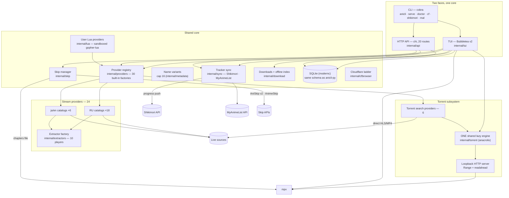

# 📺 AniCLI-Go

<div align="center">

**Terminal anime media center**

A Go port of `anicli-py`: search 30 live sources, stream or download through mpv, sync
progress with Shikimori or MyAnimeList, extend the catalog with sandboxed Lua providers,
and skip openings automatically — one static binary with a TUI, an optional HTTP API,
and an interface in English or Russian.

[](https://go.dev/)
[](https://github.com/charmbracelet/bubbletea)
[](https://github.com/charmbracelet/lipgloss)
[](https://github.com/anacrolix/torrent)
[](https://gitlab.com/cznic/sqlite)
[](https://mpv.io/)

[](https://github.com/go-chi/chi)
[](https://github.com/spf13/cobra)
[](https://github.com/bogdanfinn/tls-client)
[](https://github.com/yuin/gopher-lua)
[](https://github.com/chromedp/chromedp)
[](https://goreleaser.com/)
[](https://github.com/GoogleContainerTools/distroless)
[](Makefile)
[](LICENSE)

[Architecture](#-system-architecture) · [Quick Start](#-quick-start) · [Providers](#-providers) · [API](#-api-surface) · [Configuration](#-configuration) · [Testing](#-testing)

</div>

---

## 📑 Table of Contents

- [System Architecture](#-system-architecture)
- [Project Structure](#-project-structure)
- [Core Modules](#-core-modules)
- [Search Pipeline](#-search-pipeline)
- [Providers](#-providers)
- [Lua Provider SDK](#-lua-provider-sdk)
- [Torrent Engine](#-torrent-engine)
- [Player & Skips](#-player--skips)
- [Discord Rich Presence](#-discord-rich-presence)
- [Localization](#-localization)
- [API Surface](#-api-surface)
- [Configuration](#-configuration)
- [Data & Backup](#-data--backup)
- [Security](#-security)
- [Quick Start](#-quick-start)
- [Local Development](#-local-development)
- [Testing](#-testing)
- [Screenshots](#-screenshots)
- [Provider Roster](#-provider-roster)
- [Access Points](#-access-points)
- [License](#-license)

---

## 🗺️ System Architecture



Request flow:

1. A query enters through the TUI search screen or `GET /api/v1/search`.
2. With Shikimori enabled the query is enriched: autocomplete → the top-ranked card →
   every name on the card (russian, original, english[], japanese[], synonyms[]) plus
   metadata aliases → a variant pool capped at 16, original query first.
3. Variants route by provider content language (ru → Cyrillic index, ja/en → Latin) and
   fan out to all registered providers with bounded parallelism and a 30 s per-provider
   budget.
4. Failures stay local: a timed-out, geo-blocked, or captcha-walled provider degrades
   only its own row — results from healthy providers still surface.
5. Cross-source duplicates merge into one group; picking a group hydrates the
   episode × dub matrix and binds the title to Shikimori.
6. Playing resolves streams fresh on every launch (resolve caching is forbidden),
   unboxes player embeds through the extractor factory, and launches mpv with the
   source's headers; the skip manager writes FFMETADATA chapters.
7. Torrent results ride the single shared engine: metadata arrives via trackers or DHT,
   and playback streams over a loopback HTTP server into the same mpv path.

---

## 📂 Project Structure

```text
anicli-go/
├── cmd/
│   ├── anicli/                single binary entry point (cobra root)
│   └── parity/                live provider probe — smoke + full search checks
├── internal/
│   ├── api/                   HTTP API face — chi, 20 routes, token auth
│   ├── buffered/              sequential playback buffering
│   ├── cfbrowser/             stealth-Chromium Cloudflare challenge ladder
│   ├── cli/                   cobra command tree (serve, doctor, cf, shikimori, mal)
│   ├── config/                settings.toml loading + env overrides
│   ├── contracts/             provider/episode/stream interfaces
│   ├── crypto/                AES-CBC + HMAC token primitives
│   ├── discord/               optional Rich Presence — IPC client, stdlib only
│   ├── download/              bounded background downloader + offline index
│   ├── extractors/            10 player extractors (kodik, sibnet, blogger, …)
│   ├── i18n/                  locale system — bundled en/ru tables + user overrides
│   ├── loadtest/              SLO load suite (build tag `load`)
│   ├── lua/                   user provider runtime — sandboxed VM + `anicli` SDK
│   ├── mal/                   MyAnimeList client (OAuth2 + PKCE)
│   ├── metadata/              alias aggregation + query variants (cap 16)
│   ├── netclient/             tls-client wrapper — fingerprint, proxy, watchdog
│   ├── player/                mpv argv builder + process lifecycle
│   ├── providers/             30 built-in providers + registry + TorrentBase
│   ├── regression/            API contract golden files (all 20 endpoints)
│   ├── rules/                 dub-stream filter rules
│   ├── shikimori/             Shikimori API client (cookie + OAuth2)
│   ├── skip/                  AniSkip v2 / AnimeSkip / IntroSkipper
│   ├── storage/               SQLite repositories (pure-Go driver)
│   ├── sync/                  dual-tracker progress dispatcher
│   ├── torrent/               shared engine wrapper + loopback stream server
│   └── tui/                   Bubbletea v2 screens
├── locales/                   bundled locale tables (en.toml, ru.toml) + translation guide
├── settings.example.toml      fully commented settings template (comments in Russian)
├── Dockerfile                 distroless runtime image
├── .goreleaser.yaml           5-target release matrix (CGO off)
└── THIRD-PARTY-NOTICES.md     dependency license inventory
```

---

## 🧩 Core Modules

| Module | Purpose | Key details |
| :-- | :-- | :-- |
| `tui` | Terminal face — session state machine | root menu (7 entries: continue, lists, seasonal calendar, downloads, DB, health, exit), live search settle counter, tracker setup screens |
| `api` | HTTP face — 20 routes under `/api/v1` | HMAC-signed access tokens, pbkdf2 users, `X-Trace-Id` correlation |
| `providers` | Source registry — 30 built-in factories in pinned order | one `tls-client` per provider (own cookie jar, tagged errors), `SearchDelegator` stats |
| `lua` | User-written providers | sandboxed gopher-lua: fresh VM per invocation, 1 MiB body/`string.rep` caps, `anicli` SDK |
| `extractors` | Player embeds → direct streams | kodik, sibnet, aniboom, alloha, aksor, dood, gogoplay, streamtape, blogger, cdnvideohub |
| `torrent` | BitTorrent streaming | anacrolix engine wrapper, multilink ingest, loopback HTTP with `Range` |
| `sync` | Dual-tracker dispatcher | one progress event fans out to every enabled tracker (Shikimori, MyAnimeList) |
| `shikimori` | Shikimori client | cookie + OAuth2 (auto-refresh), autocomplete, full name card |
| `mal` | MyAnimeList client | OAuth2 + PKCE (`plain`), auto-refresh, `my_list_status` CRUD |
| `metadata` | Query expansion | anilist/kitsu/anisearch/anidb aliases merged with the Shikimori card, cap 16 |
| `skip` | Opening/ending detection | `aniskip → anime_skip → intro_skipper` chain, FFMETADATA chapters |
| `download` | Offline library | bounded concurrency, ffmpeg mux, `.anicli_offline_index.json` |
| `storage` | SQLite persistence | same schema as anicli-py, pure-Go driver, no CGO |
| `player` | mpv integration | argv ported verbatim, per-source headers, chapters cleanup, `--save-position-on-quit` |
| `discord` | Rich Presence (optional) | IPC JSON frames, "watching" activity, fail-soft when Discord is absent |
| `i18n` | Locale system | bundled `en`/`ru` TOML tables + user overrides, hard English fallback |
| `cfbrowser` | Cloudflare bypass | stealth Chromium auto-download, Ed25519-verified updates, solve on demand |
| `netclient` | Shared HTTP plumbing | Chrome-fingerprint TLS, silent-connection watchdog, global proxy |

---

## 🔎 Search Pipeline

The hybrid search is `internal/tui/search.go`; variant expansion lives in
`internal/metadata/manager.go`.

- **Enrichment** — Shikimori autocomplete over the original query → the TOP card binds
  (Shikimori's own relevance rank; the local fuzzy matcher was removed) → `GetAnime(id)`
  returns the full name inventory: russian, original, english[], japanese[], synonyms[] —
  5+ names per title.
- **Variants** — the inventory merges with metadata aliases into a deduplicated pool
  capped at `maxQueryVariants = 16`, original query first. Any enrichment failure
  degrades quietly to the previous stage's names, never to zero.
- **Language routing** — each provider declares a content language (pinned by a roster
  test): `ru` receives Cyrillic variants, `ja`/`en` receive Latin ones.
- **Fan-out** — all variants go to every registered provider under
  `network.max_parallel` with a per-provider `network.search_timeout` budget (30 s
  default); the TUI renders a live table with a settle counter.
- **Fail-soft everywhere** — a provider that times out, answers a geo-block, or hits a
  captcha degrades only its own row; a remembered-dub failure falls through to the full
  merged resolve of the rest, never killing the flow.
- **Grouping** — cross-source duplicates merge with local semantic grouping; no neural
  network, unlike the Python original's ONNX MiniLM.
- **Fresh resolve** — `ResolveStream` results are never cached: every episode launch
  re-resolves (a deliberate landmine fix from the Python original).

---

## 📡 Providers

`internal/providers/factory.go` lists the provider constructors in the registry order —
30 factories: 24 stream + 6 torrent. A meta-test pins the roster: exact count, unique
IDs, pinned order, and fixtures per provider.

- **One HTTP client each** — every provider gets its own `tls-client` instance with a
  browser-fingerprint profile, a private cookie jar, and provider-tagged errors. No
  cookie cross-talk.
- **Declarative exclusion** — `[providers].exclude` skips IDs entirely (no client, no
  registry slot); `[providers].exclude_streams` filters trash dub streams by regex.
  Providers that cannot run without user configuration (kodik without a token) are
  never registered and surface in the disabled set with a red startup notice.
- **Written from live sites** — most non-ported providers carry protocol notes captured
  from the live site (DLE catalogs, GraphQL, Livewire payloads, newznab feeds, Anubis
  proof-of-work, statically unpacked AES/CBC player bundles — no JavaScript executed).
- **Extractor factory** — player embeds unbox through 10 shared extractors; provider
  code never parses a player page that a factory extractor already covers.
- **Cloudflare ladder** — every client carries the CF retry ladder; re-challenging hosts
  escalate to the stealth-Chromium solver on demand.
- **Extensible** — user scripts in Lua register alongside the built-ins
  (see [Lua Provider SDK](#-lua-provider-sdk)).

The live health gate is `make parity` (see [Provider Roster](#-provider-roster)).

---

## 🔧 Lua Provider SDK

anicli-go is extensible without recompiling: drop a provider script into
`~/.config/anicli/providers/<id>/main.lua` (honors `XDG_CONFIG_HOME`) and it registers
alongside the built-ins on the next start.

**Discovery rules** (`internal/lua/discovery.go`):

- every `<id>/main.lua` conforming to the contract is loaded; the directory name is the
  intended provider ID;
- discovery runs **after** the built-ins, so a script can never shadow a compiled
  provider — a duplicate ID is skipped with a warning, never fatal;
- a broken script (syntax error, incomplete contract, budget overrun) is skipped with a
  logged reason; one bad script never blocks the others or startup.

**Contract** — the script returns one table: a required `id` plus three methods, with
optional metadata:

```lua
-- ~/.config/anicli/providers/mysource/main.lua
return {
  id = "mysource",            -- required, unique
  name = "My source",         -- optional display name
  base_url = "https://…",     -- optional
  capabilities = "video",     -- optional: "video" | "audio" | "both"

  search = function(query) … end,
  episodes = function(url) … end,
  streams = function(episode) … end,
}
```

Return values are marshaled into the same provider contract the built-ins satisfy, with
provider-scoped field validation; the contract tests
(`internal/lua/provider_test.go`) double as executable examples.

**The `anicli` SDK** (`internal/lua/sdk.go`) — the global table scripts program against:

| Namespace | Functions |
| :-- | :-- |
| `anicli.http` | `get`, `get_json`, `post`, `query_escape` |
| `anicli.json` | `decode`, `encode` |
| `anicli.html` | `parse` |
| `anicli.regexp` | `match` |
| `anicli.base64` | `encode`, `decode` |
| `anicli.time` | `now` (RFC 3339 UTC) |
| `anicli.log` | `info`, `warn`, `error` |
| `anicli.version` | SDK version string |

HTTP calls carry the VM's deadline context, can ride the shared fingerprinted network
client, and are capped before a byte reaches the script.

**Sandbox** (`internal/lua/engine.go`) — every invocation runs in a fresh gopher-lua
state: standard-library surface stripped and re-issued, `string.rep` results capped at
1 MiB, `string.format` width-capped, and HTTP response bodies capped at 1 MiB. A script
can stall its own call, never the app.

---

## 🌊 Torrent Engine

`internal/torrent` wraps `github.com/anacrolix/torrent` — pure Go, CGO-free, uTP
fallback — behind one shared lazy engine. The registry builds it once when
`[torrent] enabled = true`, injects it into every torrent provider via `SetEngine`, and
owns its teardown; the TUI reuses the same engine. Nothing networked starts until a
release is actually opened.

- **Multilink ingestion** — magnets (hex and base32 btih infohashes), direct `.torrent`
  URLs, and raw metainfo bytes all ingest through one path. Ingestion validates by
  content (`metainfo.Load`): anything serving bencode is accepted; an HTML park page
  fails as a typed error. A zero infohash is rejected before it can panic the library.
- **Preflight** — torrent search providers fetch `.torrent` bytes at search time
  (bounded ≤8-wide, 10 s per URL) and drop dead links before surfacing; survivors'
  bytes are handed to the engine via `IngestMetaInfo` under the original link, so the
  later ingest is a dedupe hit with no double fetch.
- **Trackers** — static `[torrent].trackers` plus `[torrent].tracker_lists` (external
  plain-text lists fetched once per engine start through the common network client,
  deduped, health-checked in a bounded pool; dead announce URLs are dropped with a
  logged reason). Trackers are attached to every torrent so metadata arrives via
  announces instead of slow DHT-only discovery.
- **Port fallback** — if `[torrent].port` (default 42069) is busy, the engine listens
  on a random free port with a loud WARN; outbound traffic (DHT, peers, announces)
  works from any port. `port = 0` always picks ephemeral.
- **Playback** — a loopback HTTP server serves files with `Content-Length` + `Range`
  (416-correct) over the engine's on-demand reader with `readahead_mb` (default 32),
  so mpv can seek. Torrent playback enters the same player path as provider streams.
- **Release parsing** — names parse into resolution (2160…360), source (BDRip/WEB-DL/…),
  codec, group, and episode ranges; files map to episodes for the standard play flow.
- **Ethics** — `no_upload = false` by default (seeding back after watching); set it to
  `true` for leech-only operation.

---

## ▶️ Player & Skips

`internal/player` builds the mpv argv — a verbatim port of the Python original,
option order included: 2 GiB demuxer cache, 16 MiB stream buffer, `--hwdec=auto-safe`,
network timeout, `--force-media-title`, per-source HTTP headers (the Referer some CDNs
require), `--audio-file` when video and audio come from separate URLs, and
`--save-position-on-quit` so mpv itself remembers the resume point.

The skip manager (`internal/skip`) resolves intro/ending chapters through the configured
`providers_order` chain — default `["aniskip", "anime_skip", "intro_skipper"]`:

- **AniSkip v2 + AnimeSkip** are queried in parallel and merged smartly (by skip type,
  provider priority);
- **IntroSkipper** is the local ffprobe/ffmpeg heuristic fallback for owned files;
- the result becomes an FFMETADATA chapters file passed to mpv as `--chapters-file`
  and deleted when the player exits.

Downloads (`internal/download`) run as a bounded background queue with ffmpeg muxing
and an offline index (`.anicli_offline_index.json`) the TUI's downloads screen reads.

---

## 🎮 Discord Rich Presence

Optional: while mpv plays, anicli publishes a "Watching" activity — the title plus,
optionally, the episode number — to your Discord profile
(`internal/discord`, stdlib-only IPC, no external dependencies).

```toml
[discord]
enabled = true
client_id = "1234567890123456789"  # Application ID from discord.com/developers/applications
show_episode = true                # "Title — ep. 5" instead of just "Title"
```

Setup: create an application at
[discord.com/developers/applications](https://discord.com/developers/applications)
(no redirect URI needed; the Rich Presence toggle is irrelevant) and paste its
Application ID into `client_id`.

Behavior:

- speaks the documented Discord RPC-over-IPC protocol — raw JSON frames over a Unix
  domain socket (Windows: named pipe);
- requires the Discord **desktop client** to be running; if the IPC pipe is not found,
  presence is silently skipped and playback is untouched;
- presence is set on playback start and cleared on stop; a hung pipe can never wedge
  the player (the IPC worker is bounded and fail-soft).

---

## 🌐 Localization

The entire TUI resolves its strings through the locale system (`internal/i18n`):
menus, search, session, seasonal calendar, setup and DB screens.

```toml
[general]
locale = "ru"   # "en", "ru", or any table in ~/.config/anicli/locales/<lang>.toml
```

- **Bundled tables** — `locales/en.toml` (the source of truth) and `locales/ru.toml`
  ship inside the binary; the default locale is `ru` (the original app is Russian).
- **Community overrides** — a user file `~/.config/anicli/locales/<lang>.toml` is
  loaded without a rebuild. A file named like a bundled table (`ru.toml`) overrides it
  key by key; a new language (`ja.toml`, `pt-BR.toml`, …) switches the whole interface
  via `[general] locale = "<lang>"`.
- **Fallback chain** — a missing key resolves from the active table, then the bundled
  table, then `en.toml`, then renders as the key itself — so a typo is visible on
  screen instead of failing silently. An unknown locale is a loud startup error naming
  the searched paths.
- **Contributing a language** — copy `locales/en.toml` to `locales/<lang>.toml`
  (BCP-47 short code), translate the values (keep `{placeholders}` verbatim), and open
  a pull request; the format rules live in [`locales/README.md`](locales/README.md).

---

## 🔌 API Surface

`internal/api` serves 20 routes under `/api/v1` (chi router):

| Method | Path | Purpose |
| :-- | :-- | :-- |
| `GET` | `/api/v1/health` | Readiness probe |
| `POST` | `/api/v1/auth/login` | Password login → access + refresh tokens |
| `POST` | `/api/v1/auth/refresh` | Rotate the session |
| `POST` | `/api/v1/auth/logout` | Invalidate the session |
| `GET` | `/api/v1/auth/me` | Current user |
| `GET` | `/api/v1/providers` | Registry status + stats |
| `GET` | `/api/v1/history` | Watch history (paginated) |
| `GET` | `/api/v1/history/{anime_id}` | One title's history |
| `PATCH` | `/api/v1/history/{anime_id}` | Update history entry |
| `GET` | `/api/v1/history/{anime_id}/episodes` | Episode list with progress |
| `GET` | `/api/v1/history/{anime_id}/progress` | Resume position |
| `PATCH` | `/api/v1/history/{anime_id}/progress` | Save progress |
| `GET` | `/api/v1/library` | Shikimori-bound library |
| `POST` | `/api/v1/library/bind` | Bind a title to Shikimori |
| `GET` | `/api/v1/search` | Fan-out search |
| `GET` | `/api/v1/releases/calendar` | Release calendar |
| `GET` | `/api/v1/home/feed` | Aggregated home feed |
| `GET` | `/api/v1/episodes` | Episode × dub matrix |
| `POST` | `/api/v1/streams/resolve` | Fresh stream resolution |
| `GET` | `/api/v1/shikimori/anime/{anime_id}/page` | Shikimori title page |

Auth is token-based: HMAC-SHA256-signed access tokens (15 min TTL) with rotating
refresh sessions (720 h) against `[web.users]` pbkdf2-hashed credentials. The server
binds `127.0.0.1:8765` by default and stamps every response with `X-Trace-Id`. API
contract goldens for all 20 endpoints live in `internal/regression`.

A minimal client session:

```bash
# 1) Log in with a [web.users] account (requires [api].enabled = true + auth_secret_key)
TOKEN=$(curl -s -X POST http://127.0.0.1:8765/api/v1/auth/login \
  -H 'Content-Type: application/json' \
  -d '{"login": "alice", "password": "YOUR_PASSWORD"}' \
  | jq -r '.access_token')

# 2) Fan-out search across every registered provider
curl -s -H "Authorization: Bearer $TOKEN" \
  'http://127.0.0.1:8765/api/v1/search?q=frieren'

# 3) Page through watch history (limit ≤ 10000, offset ≤ 100000; omitted = full list)
curl -s -H "Authorization: Bearer $TOKEN" \
  'http://127.0.0.1:8765/api/v1/history?limit=20&offset=40'
```

---

## ⚙️ Configuration

Resolution order: `--config` flag → `$ANICLI_CONFIG` →
`$XDG_CONFIG_HOME/anicli/settings.toml` → `~/.config/anicli/settings.toml`.
A missing file is not an error — defaults are built in. The bundled
`settings.example.toml` documents every key (its comments are in Russian); the same
ground, in English:

```toml
[general]
locale = "ru"             # UI language: "en", "ru", or ~/.config/anicli/locales/<lang>.toml
# data_dir = ""           # empty -> $ANICLI_DATA > $XDG_DATA_HOME/anicli > ~/.local/share/anicli

[network]
connect_timeout = "10s"   # also the silent-connection budget
request_timeout = "30s"
search_timeout = "30s"    # per-provider fan-out budget
max_parallel = 4
user_agent = "Mozilla/5.0 (Windows NT 10.0; Win64; x64) … Chrome/124.0.0.0 Safari/537.36"
# proxy_url = ""          # http/https/socks5 — global route for every source request

[player]
path = "mpv"              # absolute path on Windows: "C:\\Program Files\\mpv\\mpv.exe"
quality = "1080"          # closest available is picked

[shikimori]
enabled = false           # cookie (`session`) or OAuth2 (`anicli shikimori auth`)

[mal]
enabled = false           # OAuth2 + PKCE (`anicli mal auth`); syncs alongside Shikimori

[skip]
providers_order = ["aniskip", "anime_skip", "intro_skipper"]
anime_skip_enabled = true
intro_skipper_enabled = true

[download]
# dir = ""                # empty -> <data>/downloads
max_concurrency = 2

[api]
enabled = false           # HTTP API face; auth_secret_key is REQUIRED when enabled
bind = "127.0.0.1:8765"   # loopback only by default
token_ttl = "15m"
refresh_token_ttl = "720h"
# auth_secret_key = "a-long-random-string"

# [web.users.alice]       # pbkdf2_sha256$<iterations>$<salt_b64url>$<digest_b64url>
# password_hash = "pbkdf2_sha256$240000$…"

[providers]
# exclude = ["gogoanime"]              # IDs never registered (no client, no slot)
# exclude_streams = ["trailer", "AD"]  # dub-name regexes dropped from listings

[providers.kodik]
# token = "YOUR_KODIK_TOKEN"   # without it kodik registers as disabled (red notice)

[providers.hdrezka]
# base_url = "https://rezka-ua.tv"  # re-points the serving mirror of the rezka family

[torrent]
enabled = true            # lazy: nothing networked until a release opens
# dir = ""                # empty -> <data>/torrents (created on demand)
port = 42069              # busy -> random free port + WARN; 0 = always ephemeral
no_upload = false         # false = seed after watching; true = leech-only
readahead_mb = 32
# proxy = ""              # engine HTTP traffic only; peer/UDP-tracker traffic stays direct
# trackers = ["udp://tracker.opentrackr.org:1337/announce"]
# tracker_lists = ["https://raw.githubusercontent.com/ngosang/trackerslist/master/trackers_all.txt"]

[cf]
channel = "auto"          # free base; auto-upgrades to pro with a valid `anicli cf login` key
solve_timeout = "90s"
browser_idle_timeout = "15s"
auto_update = true        # stealth-Chromium self-update; CLOAKBROWSER_AUTO_UPDATE=false forces off
# update_interval = "30m" # retry period for updates deferred by offline state
# proxy = ""              # browser downloads/updates ONLY — never source traffic

[discord]
enabled = false
client_id = ""            # Application ID (see Discord Rich Presence)
show_episode = true
```

Environment variables override file values:

| Variable | Purpose |
| :-- | :-- |
| `ANICLI_PROXY_URL` | proxy (http/https/socks5) for all source traffic |
| `ANICLI_SHIKIMORI_SESSION` | `_kawai_session` cookie |
| `ANICLI_API_AUTH_SECRET` | API token signing key |
| `ANICLI_KODIK_TOKEN` | Kodik API token |
| `ANICLI_DB_URL` | SQLite database path |
| `ANICLI_DATA` | data directory |
| `CLOAKBROWSER_AUTO_UPDATE` | `false` disables stealth-Chromium self-update |
| `CLOAKBROWSER_LICENSE_KEY` | CloakBrowser pro key (overrides `~/.cloakbrowser/license.key`) |

Slow torrent metadata is a tracker problem: without announce URLs, magnets fall back to
DHT-only discovery that rarely fits the wait budget. Point `trackers` (or the whole
`tracker_lists` list) at healthy announce URLs — the engine health-checks them and
attaches only live ones to every torrent.

---

## 💾 Data & Backup

Everything anicli persists lives under one data directory —
`$ANICLI_DATA` → `$XDG_DATA_HOME/anicli` → `~/.local/share/anicli`
(`[general].data_dir` overrides):

| What | Location | Override |
| :-- | :-- | :-- |
| SQLite database | `<data>/anicli.db` (created on demand) | `ANICLI_DB_URL` |
| Downloads | `<data>/downloads` | `[download].dir` |
| Offline index | `<downloads>/.anicli_offline_index.json` | — |
| Torrent session data | `<data>/torrents` (created on demand) | `[torrent].dir` |
| Settings | `~/.config/anicli/settings.toml` | `--config`, `ANICLI_CONFIG` |
| Lua providers | `~/.config/anicli/providers/<id>/main.lua` | `XDG_CONFIG_HOME` |
| Locale overrides | `~/.config/anicli/locales/<lang>.toml` | `XDG_CONFIG_HOME` |

Watch history, episode progress, provider stats, and API sessions live in the SQLite
file; tracker tokens live in `settings.toml`. Backing up is copying one file plus your
downloaded videos:

```bash
# consistent snapshot of the DB even while anicli is running
sqlite3 ~/.local/share/anicli/anicli.db ".backup '/backup/anicli.db.bak'"

# plus the offline library
rsync -a ~/.local/share/anicli/downloads/ /backup/downloads/
```

Restore by copying back. The schema is identical to anicli-py's, so the database is
portable between the two frontends.

---

## 🔒 Security

- **No secrets in the repository** — real tokens ride environment variables; examples
  use placeholders. `[web.users]` stores pbkdf2-hashed passwords only.
- **Loopback-first API** — `[api].bind` defaults to `127.0.0.1:8765`; exposure is an
  explicit configuration act. Tokens are HMAC-SHA256-signed with short access TTLs and
  rotating refresh sessions.
- **Distroless runtime** — the Docker image is `gcr.io/distroless/static-debian12`:
  no shell, no package manager, running as `nonroot:nonroot`.
- **Bounded CF bypass** — the stealth browser runs only during a solve (`solve_timeout`
  90 s) and shuts down after idle (15 s) instead of staying resident; auto-updates
  verify Ed25519-signed manifests; `CLOAKBROWSER_AUTO_UPDATE=false` disables them.
- **Explicit proxy boundaries** — `network.proxy_url` routes source traffic; `[cf].proxy`
  routes only stealth-browser downloads/updates; `[torrent].proxy` routes engine HTTP
  traffic (peer and UDP-tracker traffic stays direct — a library limitation, documented).
- **Sandboxed extensibility** — Lua providers run in a stripped, budget-capped VM with
  fresh state per invocation; scripts cannot shadow built-ins or outlive their call.
- **Torrent hygiene** — port fallback warns loudly with the real port; tracker lists
  fail open (static trackers keep working when a list download fails).
- **License hygiene** — `THIRD-PARTY-NOTICES.md` carries the full direct-dependency
  inventory (`make notices`), including tls-client's BSD-4-Clause advertising notice.

---

## 🚀 Quick Start

### 1. Prerequisites

| Tool | Needed for |
| :-- | :-- |
| **mpv** | playback (on `$PATH`, or set `[player].path`) |
| **ffmpeg + ffprobe** | downloads and the local IntroSkipper heuristic |
| Go ≥ 1.27 | building from source (CGO not needed — pure-Go SQLite) |
| Discord desktop | optional — Rich Presence only |

### 2. Install

```bash
cp settings.example.toml ~/.config/anicli/settings.toml   # optional — defaults are built in
```

Build from source:

```bash
make build
go build -o ./anicli ./cmd/anicli
```

Or grab a release archive (`goreleaser`, 5 targets: linux/amd64+arm64, windows/amd64,
darwin/amd64+arm64; checksums in `checksums.txt`) and put `anicli` on `$PATH`.
Docker builds the same binary into a distroless image:

```bash
docker build -t anicli:latest .
docker run --rm -p 8765:8765 \
  -v $PWD/settings.toml:/config/settings.toml \
  anicli:latest serve --config /config/settings.toml
```

### 3. Run

```bash
anicli            # TUI
anicli serve      # HTTP API face ([api].enabled)
anicli doctor     # environment diagnostics
```

The root menu leads to the continue-watching shortcut, the catalog lists (search lives
there), the seasonal calendar, downloads, DB management, and the health screen;
disabled providers and unconfigured integrations show as red startup notices.

### 4. Verify

`anicli doctor` checks the live environment before you commit to a session: provider
reachability (each under its `search_timeout` budget), the mpv binary, and data paths.
Inside the TUI, the health screen shows the same picture at any time.

### 5. Trackers (Shikimori + MyAnimeList)

Progress syncs to every tracker you authorize — both at once is supported, and
either one alone works exactly the same:

```bash
anicli shikimori auth     # Shikimori OAuth2 (app: https://shikimori.io/apps)
anicli mal auth           # MyAnimeList OAuth2 + PKCE
anicli shikimori status   # per-tracker diagnostics: anicli mal status
```

The first TUI launch also offers both trackers on the setup screen (arrow keys,
Enter).

**MyAnimeList app registration** (one-time, your own account):

1. Sign in at [myanimelist.net](https://myanimelist.net) and open the API panel:
   <https://myanimelist.net/en/apiproxy> → *Create App*.
2. Fill **App name** (anything), **App type**: `web`.
3. **Redirect URI**: `http://127.0.0.1:<port>/callback` — pick any loopback port
   (e.g. `http://127.0.0.1:8765/callback`). With exactly one registered URI the
   port may stay random on every run; otherwise pass `--port <port>`.
4. Run `anicli mal auth --client-id <Client ID> --client-secret <Client Secret>`
   — the browser opens, you approve, and the tokens land in `[mal]` of
   `settings.toml` (the access token refreshes automatically; the refresh token
   lives ~1 month).

Episode progress pushes to Shikimori (`episodes=N`, `planned→watching`) and to
MyAnimeList (`num_watched_episodes=N`, `plan_to_watch→watching`) at launch. A
title missing from MyAnimeList is skipped with a typed note; the local history
database is never touched by either tracker.

---

## 💻 Local Development

```bash
make build           # go build ./...
make test            # go test -race -count=1 ./...
make lint            # golangci-lint run
make goldens-update  # regenerate API contract goldens (review the diff!)
make parity          # live probe: all 30 providers against real sites
make load            # SLO load suite
make build-matrix    # CGO_ENABLED=0 cross-compile of every goreleaser target
make notices         # dependency inventory for THIRD-PARTY-NOTICES.md
make release         # goreleaser release artifacts
make docker-build    # distroless image (local tag)
```

---

## ✅ Testing

The full local gate:

```bash
gofmt -l .
go vet ./...
go vet -tags live ./...
golangci-lint run
go test -race -count=1 ./...    # 1765 tests in the default build
```

Quality layers beyond the unit suite:

```bash
make parity           # live probe of all 30 providers; exits non-zero below 29/30 answering
make load             # SLO tests behind the `load` build tag: p99 < 250 ms, errors < 0.1%
make goldens-update   # API contract goldens — all 20 endpoints (internal/regeneration)
make build-matrix     # platform-portability regression (no platform-only APIs)
```

- `make load` runs without `-race` so latency SLOs stay wall-clock honest; the same paths
  have a separate race-safety invocation documented in the `Makefile`.
- Provider live checks sit behind the `live` build tag and need network access;
  `make parity` is the scripted end-to-end version.
- The API contract is pinned by golden files for all 20 routes; after an intentional
  contract change run `make goldens-update` and review the diff.
- **CI**: no GitHub Actions workflow ships yet — the gate above runs locally; standing
  up CI is a known TODO.

---

## 📸 Screenshots

> **TODO** — no captures shipped yet. The TUI is best shown moving: root menu →
> hybrid search with the per-provider settle table → session screen with the
> episode × dub matrix → seasonal calendar. GIFs made with
> [vhs](https://github.com/charmbracelet/vhs) or terminalizer are welcome —
> drop them here.

---

## 🌍 Provider Roster

Registration order from `internal/providers/factory.go`, pinned by a roster meta-test.
Statuses reflect the most recent live verification of each source;
`make parity` re-checks all 30 in minutes.

| Provider | Site | Lang | Type | Status |
| :-- | :-- | :-- | :-- | :-- |
| anilibria | aniliberty.top | ru | video+audio | ✅ live |
| animevost | api.animevost.org | ru | video | ✅ live |
| anilib | api.cdnlibs.org | ru | video+audio | ✅ live |
| animego | animego.one | ru | video | ✅ live |
| gogoanime | gogoanime3.co | ja | video | ⚠️ mirrors rotate |
| kickassanime | kaa.lt | ja | video (EN subs) | ✅ live; fan-out dub hydration |
| anizone | anizone.to | ja | video (EN subs) | ✅ live; sub-only, Livewire |
| sameband | sameband.studio | ru | video | ⚠️ unstable |
| kodik | kodik-api.com | ru | video | ⚠️ API token required |
| anidub | online.anidub.com | ru | video (RU dub) | ✅ live |
| animedia | amd.online | ru | video (RU dubs) | ✅ live; DLE → kodik embeds |
| shiza | shizaproject.com | ru | video (RU dubs+subs) | ✅ live; public GraphQL |
| yummy | site.yummyani.me | ru | video (RU, up to 4K) | ✅ live; JSON API, CVH chain |
| hdrezka | rezka-ua.tv | ru | video (RU dubs, ≤1080) | ✅ live; Anubis solver; `base_url` re-points mirror |
| anistar | anistar.org | ru | video (RU dubs, ≤720) | ✅ live; Windows-1251 DLE |
| anifilm | anifilm.pro | ru | video (RU dubs) + torrents | ✅ live; Yii+Vue engine |
| animemobi | animemobi.com | ru | video + DL | ✅ live; mobile DLE |
| anitokyo | anitokyo.tv | ru | video (RU dubs+subs) | ✅ live; one-fetch RalodePlayer blob |
| animiku | beta.animiku.tokyo | ru | video (RU dubs+subs) | ✅ live; aaparser AJAX → kodik |
| anikado | anikado.net | ru | video (RU dubs+subs) | ✅ live; per-episode dub tables |
| animevib | `www.animevib.ru` | ru | video (RU dubs+subs) | ✅ live; merged dub × episode table |
| animeheaven | animeheaven.me | ja | video (EN subs, direct MP4) | ✅ live; no Cloudflare |
| anikoto | anikototv.to | en | video (EN dub+subs) | ✅ live; megaplay bundle unpacked |
| anipub | anipub.xyz | en | video (EN dub+subs) | ✅ live; open Express+Mongo API |
| anilibria-torrent | aniliberty.top | ru | torrent search | ✅ live; AniLibria trackers |
| animetosho | feed.animetosho.org | ja | torrent search | ✅ live; newznab, preflight |
| tokyotosho | `www.tokyo-tosho.net` | ja | torrent search | ✅ live; search RSS, preflight |
| rutor | rutor.info | ru | torrent search (RU, ≤4K) | ✅ live; fully anonymous |
| anirena | `www.anirena.com` | ja | torrent search (JA/multi) | ✅ live; RSS `<enclosure>` |
| subsplease | subsplease.org | ja | torrent search (EN season) | ✅ live; JSON API, batch hop |

Notes:

- The hdrezka family geo-fences per domain; the built-in default pins the serving
  mirror and `[providers.hdrezka].base_url` re-points it without a rebuild.
- Several sources are region-gated or SNI-blocked from some networks —
  `network.proxy_url` is the documented remedy.
- Torrent search providers stream through the `[torrent]` subsystem; disabling
  `[torrent]` automatically disables them.

Removed / dead sources (kept for the record):

| Source | Reason |
| :-- | :-- |
| animekai | shut down 2026-05-10; domains NXDOMAIN / parked |
| anivibe | host unresponsive; former `.net` domain hijacked by an ad farm |
| sovetromantica | domain hijacked into a casino farm; project frozen since 2025 |

Probe everything live: `make parity` — `parity all` exits non-zero when fewer than 29
of the 30 registered providers answer.

---

## 🚪 Access Points

| Surface | Address | Notes |
| :-- | :-- | :-- |
| TUI | your terminal | the primary face — `anicli` |
| HTTP API | `127.0.0.1:8765` | opt-in (`[api].enabled`); loopback by default |
| Torrent stream server | `127.0.0.1:42069` | loopback; random free port if busy; alive only while a torrent streams |
| Discord IPC | desktop socket / named pipe | outbound only when `[discord].enabled` |
| Data directory | `~/.local/share/anicli` | SQLite DB, downloads, torrents |
| Config directory | `~/.config/anicli/` | `settings.toml`, `providers/`, `locales/` |
| Outbound APIs | Shikimori, MyAnimeList, AniSkip/AnimeSkip | tracker sync + skips; opt-in |
| Sources | 30 built-in sites + user Lua providers | see [Provider Roster](#-provider-roster) |

---

## 📄 License

[MIT](LICENSE) © 2026 An0nX
