<div align="center">

<!-- TODO: замените на реальный GIF/скриншот TUI после первого релиза -->


## anicli-go

Порт [anicli-py](../anicli-py) на Go: единый бинарник — TUI, HTTP-API и общий core на 11 аниме-источниках

[](https://go.dev/)
[](Makefile)
[](LICENSE)

</div>

---

## 📑 Содержание

- [О проекте](#-о-проекте)
- [Возможности](#-возможности)
- [Карта модулей](#-карта-модулей)
- [Установка](#-установка)
- [Быстрый старт](#-быстрый-старт)
- [Конфигурация](#-конфигурация)
- [Источники](#-источники)
- [Разработка](#-разработка)
- [Лицензия](#-лицензия)

---

## 📜 О проекте

**anicli-go** — консольный медиа-центр для просмотра аниме: поиск, воспроизведение через mpv,
загрузка серий, синхронизация со Shikimori и умные пропуски опенингов/эндингов.

Порт замороженного Python-оригинала (`anicli-py`) 1:1 — с сохранением wire-форматов API,
схемы БД и поведенческих нюансов. Ключевые отличия от предшественника:

| | anicli-py | anicli-go |
|---|---|---|
| Распространение | Poetry-окружение | один статический бинарник (~15 МБ) |
| ML-группировка | ONNX MiniLM | локальная семантическая группировка без нейросети |
| HTTP-клиент | httpx | tls-client (отпечаток Chrome 150) |
| БД | SQLAlchemy + alembic | pure-Go SQLite (modernc), та же схема |
| Пропуски | ML + API | API (AniSkip v2 + AnimeSkip) + IntroSkipper |

---

## ✨ Возможности

<details open>
<summary><b>🔍 Мульти-источник</b></summary>

| Функция | Описание |
|---------|----------|
| **Поиск** | Параллельный fan-out по 12 источникам с ограничением параллелизма |
| **Группировка** | Семантическое объединение дублей между источниками |
| **Потоки** | Извлечение прямых ссылок (HLS/MP4) из 9 типов плееров |

</details>

<details>
<summary><b>🖥️ Два интерфейса, один core</b></summary>

TUI (bubbletea v2) для терминала и HTTP-API (chi) для веб-морды — оба работают через
одни и те же сервисы: провайдеры, хранилище, shikimori-клиент, менеджер загрузок.

</details>

<details>
<summary><b>⏭️ Пропуски опенингов</b></summary>

AniSkip v2 + AnimeSkip (GraphQL) опрашиваются параллельно и умно склеиваются
(слияние по типу, приоритет провайдера); локальный IntroSkipper (ffmpeg) —
fallback для собственных файлов. Результат — FFMETADATA-главы для mpv.

</details>

<details>
<summary><b>⬇️ Загрузка серий</b></summary>

Фоновый менеджер с ограниченной конкурентностью, ffmpeg-склейка видео+аудио,
атомарная запись файлов и офлайн-индекс (`.anicli_offline_index.json`) библиотеки.

</details>

---

## 🧭 Карта модулей

```mermaid
graph TD
    subgraph interfaces["Интерфейсы"]
        TUI["TUI (bubbletea v2)<br/>internal/tui"]
        CLI["cli (cobra)<br/>internal/cli"]
        API["HTTP-API (chi)<br/>internal/api — 20 эндпоинтов"]
    end

    subgraph core["Общий core"]
        REG["Реестр провайдеров<br/>internal/providers"]
        SHIKI["Shikimori-клиент<br/>internal/shikimori"]
        SKIP["Менеджер пропусков<br/>internal/skip"]
        DL["Загрузки + офлайн-индекс<br/>internal/download"]
        ST["SQLite-хранилище<br/>internal/storage"]
        META["Метаданные<br/>internal/metadata"]
    end

    subgraph sources["Источники — 24 провайдера"]
        P1[anilibria]
        P2[animevost]
        P3[anilib]
        P4[animego]
        P6[gogoanime]
        P7[animepahe]
        P21[kickassanime]
        P22[anizone]
        P8[dreamcast]
        P9[sameband]
        P10[kodik]
        P11[allanime]
        P12[anidub]
        P19[animedia]
        P20[shiza]
        P18[anime365]
        P23[yummy]
        P24[hdrezka]
        P25[anistar]
        P14[nyaa]
        P15[anilibria-torrent]
        P16[animetosho]
        P17[tokyotosho]
        P26[subsplease]
    end

    EXT["Извлекатели плееров (11)<br/>internal/extractors"]

    TUI --> REG & SHIKI & SKIP & DL & ST
    API --> REG & SHIKI & ST
    CLI --> TUI & API
    REG --> P1 & P2 & P3 & P4 & P6 & P7 & P21 & P22 & P8 & P9 & P10 & P11 & P12 & P19 & P20 & P18 & P23 & P24 & P25 & P14 & P15 & P16 & P17
    P6 & P7 & P11 --> EXT
    SKIP --> ST
    DL --> SKIP
```



---

## 🚀 Установка

### Готовые бинарники (goreleaser)

Скачайте архив со [страницы релизов](../../releases), распакуйте и положите `anicli` в `$PATH`:

| Система | Архив |
|---------|-------|
| Linux (x86_64) | `anicli_X.Y.Z_linux_amd64.tar.gz` |
| Linux (ARM64) | `anicli_X.Y.Z_linux_arm64.tar.gz` |
| Windows (x86_64) | `anicli_X.Y.Z_windows_amd64.zip` |
| macOS (Intel) | `anicli_X.Y.Z_darwin_amd64.tar.gz` |
| macOS (Apple Silicon) | `anicli_X.Y.Z_darwin_arm64.tar.gz` |

Контрольные суммы — в `checksums.txt` рядом с релизом.

### Docker

```bash
docker build -t anicli:latest .
docker run --rm -p 8765:8765 \
  -v $PWD/settings.toml:/config/settings.toml \
  anicli:latest serve --config /config/settings.toml
```

> Образ distroless: без оболочки, под пользователем `nonroot`.

### Сборка из исходников

```bash
git clone <repo> && cd anicli-go
make build            # go build ./...
go build -o ./anicli ./cmd/anicli
```

Требуется Go ≥ 1.27. CGO не нужен (pure-Go SQLite).

---

## ⚡ Быстрый старт

```bash
# 1. Конфиг (не обязателен — дефолты встроены)
cp settings.example.toml ~/.config/anicli/settings.toml

# 2. TUI — обычный запуск
anicli

# 3. HTTP-API сервер (api.enabled = true в настройках)
anicli serve

# 4. Диагностика окружения
anicli doctor
```

---

## ⚙️ Конфигурация

Файл настроек: `$ANICLI_CONFIG` → `$XDG_CONFIG_HOME/anicli/settings.toml` →
`~/.config/anicli/settings.toml`. Секреты можно задавать переменными окружения
(они сильнее файла):

| Переменная | Назначение |
|------------|------------|
| `ANICLI_PROXY_URL` | прокси (http/https/socks5) для всех запросов |
| `ANICLI_SHIKIMORI_SESSION` | cookie-сессия Shikimori |
| `ANICLI_API_AUTH_SECRET` | секрет подписи токенов API |
| `ANICLI_KODIK_TOKEN` | имя переменной с токеном Kodik API |
| `ANICLI_DB_URL` | путь к базе данных |
| `ANICLI_DATA` | каталог данных |

Полный пример с комментариями — [`settings.example.toml`](settings.example.toml).
Ключевые секции:

```toml
[network]
proxy_url = ""          # или "http://127.0.0.1:10809"
max_parallel = 4        # предел параллельности fan-out поиска

[api]
enabled = true          # включить HTTP-API
bind = "127.0.0.1:8765" # только loopback по умолчанию

[shikimori]
enabled = false         # интеграция с трекером

[torrent]
trackers = [            # свои announce-URL (udp/http/https/ws/wss) к каждому торренту
    "udp://tracker.opentrackr.org:1337/announce",
]
tracker_lists = [       # внешние списки трекеров: один GET на старте движка, парсинг,
    "https://raw.githubusercontent.com/ngosang/trackerslist/master/trackers_all.txt",
]                       # дедуп и общая проверка здоровья вместе с trackers

[download]
max_concurrency = 2     # одновременные фоновые загрузки

[cf]
                        # PR80: параметр enabled удалён — обход Cloudflare
                        # всегда включён; стелс-Chromium скачивается
                        # автоматически при первом запуске.
channel = "auto"        # auto (по умолчанию): free-база, pro-апгрейд при действующем
                        # ключе (anicli cf login), несовместимый pro громко пропускается;
                        # free: pro не трогается даже с ключом; pro: всегда
                        # лицензионный канал
proxy = ""              # прокси ТОЛЬКО для скачиваний/обновлений CloakBrowser (PR80):
                        # загрузка браузера, free/pro-каналы, лицензия, проверки
                        # обновлений; пусто = прямое соединение; схемы http/https/socks5/socks5h.
                        # ГРАНИЦЫ: не касается страниц стелс-браузера и трафика источников —
                        # те ходят через network.proxy_url

[torrent]
enabled = true          # подсистема торрентов (nyaa/animetosho/…)
trackers = ["udp://tracker.opentrackr.org:1337/announce"]  # см. ниже
```

**Медленно тянутся метаданные торрентов?** Настройте `[torrent] trackers` —
это прямое лекарство: без трекеров магниты nyaa/animetosho ищут пиры только
через DHT, что часто не успевает в бюджет ожидания. Одной строкой (список
ngosang/trackerslist):

```toml
[torrent]
trackers = ["udp://tracker.opentrackr.org:1337/announce", "udp://open.demonii.com:1337/announce", "udp://tracker.torrent.eu.org:451/announce"]
```

Движок проверяет здоровье трекеров и подставляет только живые — к каждому
торренту (магниты nyaa/animetosho, .torrent-ссылки, metainfo), поэтому
метаданные приходят через анонсы, а не DHT. Ещё проще — не перечислять
трекеры вручную, а отдать готовый список целиком: `tracker_lists` (см.
пример конфига выше) скачивает его при старте движка и заливает в тот же
пул с той же проверкой здоровья.


---

## 📡 Источники

| Провайдер | Сайт | Тип | Статус |
|-----------|------|-----|--------|
| anilibria | aniliberty.top | видео+аудио | ✅ живой (перебазирован на новый API в PR37); поисковая выдача и часть релизов фильтруются по IP региона — из таких сетей нужен `network.proxy_url` |
| animevost | api.animevost.org | видео | ✅ живой |
| anilib | api.cdnlibs.org | видео+аудио | ✅ живой |
| animego | animego.one | видео | ✅ живой |
| gogoanime | gogoanime3.co | видео | ⚠️ зеркала часто меняются |
| animepahe | animepahe.pw | видео (англ. субтитры) | ✅ через стелс-браузерный мост CloakBrowser (всегда включён, PR80): сайт пере-челленджит небраузерные отпечатки даже с повторенными clearance-куками (досье PR71), поэтому поиск и resolve ходят через мост. Не сайт-зеркало: `animepahe.ru` мёртв, `.si` умер в 04.2026 |
| kickassanime | kaa.lt | видео (англ. субтитры) | ✅ живой (PR58); не порт — JSON API без документов, восстановлен по живому сайту: fsearch → карточка → постраничные серии → серверы на krussdomi HLS-краю; анонимный; из заблокированных сетей нужен `network.proxy_url` |
| anizone | anizone.to | видео (англ. субтитры, суб-онли) | ✅ живой (PR59); не порт — написан по живому сайту (рецепт Anivexa-API, перепроверен 2026-09-18): Livewire-пейлоады, пагинация серий через /livewire/update, HLS через vidstackPlayer; анонимный; из заблокированных сетей нужен `network.proxy_url` |
| dreamcast | dreamerscast.com | видео | ✅ живой |
| sameband | sameband.studio | видео | ⚠️ нестабильный |
| kodik | kodik-api.com | видео | ⚠️ нужен API-токен; старый домен kodakapi.com умер (NXDOMAIN) |
| allanime | api.mkissa.net | видео | ⚠️ домен ротирован 2026-07-22 (allmanga.to → mkissa.to) |
| anidub | online.anidub.com | видео (рус. дубляж) | ✅ живой; не порт — написан по живому сайту (PR22) |
| animedia | amd.online | видео (рус. озвучки) | ✅ живой (PR56); не порт — старый JSON API animedia.online мёртв, написан по живому DLE-сайту: поиск формой сайта, серии/озвучки из kodik-блоков страницы; стримы через общий kodik-экстрактор; ru-индекс (латиница не ищется), часть тайтлов отдана через rutube — типизированная ошибка |
| shiza | shizaproject.com | видео (рус. озвучки, субтитры) | ✅ живой (PR57); не порт — Nuxt-SPA, написан по живому GraphQL API (публичный, анонимный): поиск по RU-названию и ромадзи, серии из kodik/sibnet-эмбедов через общие экстракторы; torrent-раздел мёртв (0 сидов) и не регистрируется |
| anime365 | smotret-anime.app | видео (русс. озвучки и субтитры) | ✅ живой (PR55), документированный JSON API (зеркала: smotret-anime.online, anime365.ru); без токена доступа (`providers.anime365.token`, нужна активная подписка) провайдер отключается при старте; ссылки на видео выдаёт embed-API по токену |
| yummy | site.yummyani.me (API: api.yani.tv) | видео (рус. озвучки и субтитры, до 4K) | ✅ живой (PR68); порт референсной библиотеки anicli-api (source/yummy_anime.py), перепроверен живым 2026-09-19: документированный JSON API (каталог, серии одним вызовом со всеми озвучками), анонимный; плееры kodik/sibnet/alloha/aksor через общие экстракторы, CDNVideoHub-цепочка (iframe → JS-константы → плейлист → vkId) — в провайдере; RU-индекс ищет по одному токену («черная лагуна» не находит «Пираты «Чёрной лагуны»», smoke-запрос объявлен); SSR-зеркало yummyanime.in мертво (410) |
| hdrezka | rezka-ua.tv (зеркало семейства, [providers.hdrezka] base_url перекрывает) | видео (рус. озвучки, до 1080) | ✅ живой (PR72); порт замороженного anicli-api + чистый Go-решатель антибота Anubis 1.25 (PoW sha256); PR72-матрица маршрутов: семейство зеркал гео-фенсит по домену — hdrezka-home.tv с датацентровых выходов держит ссылки на видео (JWT сессии честно пишет geo:"de"), rezka-ua.tv с того же выхода отдаёт полностью, поэтому маршрут по умолчанию — он; из заблокированных сетей нужен `network.proxy_url` (прямой маршрут режется по SNI) |
| anistar | anistar.org | видео (рус. озвучки, до 720) | ✅ живой (PR77); не порт — написан по живому сайту: DLE-каталог на Windows-1251 (первый некириллически-UTF сайт в ростере — поиск POST-формой в cp1251), серии/озвучки из JS-массива p2p-плеера /test/player2/, стримы — прямые HLS/MP4 на an-media.org с обязательным Referer; анонимный; news- и manga-карточки поиска отфильтрованы |
| nyaa | nyaa.si | торрент-поиск (англ. переводы) | ✅ живой, анонимный RSS; не порт — написан по живому сайту (PR36); стрим через подсистему [torrent]; из заблокированных сетей нужен `network.proxy_url` — прямой маршрут сбрасывается (RST) |
| anilibria-torrent | aniliberty.top | торрент-поиск (русская озвучка) | ✅ живой (PR37, новый API); поиск релизов → торренты релиза, магниты с трекерами AniLibria; стрим через подсистему [torrent]; из сетей с IP-фильтрацией контента нужен `network.proxy_url` |
| animetosho | feed.animetosho.org | торрент-поиск (англ. переводы, BD-батчи) | ✅ живой (PR38), анонимный newznab-фид; магнит из infohash, фолбэк — прямой .torrent; стрим через подсистему [torrent]; из заблокированных сетей нужен `network.proxy_url`; идёт миграция домена на animetosho.xyz — следите за редиректами фида |
| tokyotosho | www.tokyo-tosho.net | торрент-поиск (аниме, старейший трекер) | ✅ живой (PR38), анонимный поисковый RSS (`rss.php?terms=…`); прямые .torrent-ссылки; стрим через подсистему [torrent]; из заблокированных сетей нужен `network.proxy_url` |
| subsplease | subsplease.org | торрент-поиск (EN-сезонка, батчи всего тайтла) | ✅ живой (PR89), анонимный JSON API (`/api/?f=search`, `/api/?f=show&sid=…`); трекер-богатые магниты (base32 btih — движок принимает), батчи back-каталога через sid-хоп страницы тайтла; RSS-фиды сайта существуют, но только «последние релизы» без параметра запроса — не используются; стрим через подсистему [torrent] |

Не портированы / удалены (мёртвые):

| Источник | Причина |
|----------|---------|
| animekai | официально закрыт 2026-05-10; домены NXDOMAIN / parked |
| anivibe | anivibe.ru не отвечает; бывший .net угнан под ad-farm |
| sovetromantica | домен sovetromantica.com угнан под казино-фарм, проект заморожен с 2025; удалён в PR22 |

Проверить доступность живых источников: `make parity` (см. ниже).

---

## 🛠 Разработка

```bash
make build          # сборка
make test           # go test -race -count=1 ./...
make lint           # golangci-lint run
make load           # нагрузочные тесты (build tag `load`)
make parity         # живой G1-гейт: минимум 23/24 провайдеров должны ответить
make goldens-update # перегенерация золотых файлов контракта API
make release        # релизные артефакты через goreleaser
make docker-build   # distroless-образ
```

### Контроль качества

| Слой | Механизм |
|------|----------|
| Контракт API | золотые файлы всех 20 эндпоинтов (`internal/regression`) |
| Инварианты TUI | таблица регрессии I1–I4 |
| Ростер провайдеров | мета-тест: ровно 24, уникальны, в закреплённом порядке, у каждого фикстуры |
| Нагрузка | SLO-тесты за build-тегом `load`: p99 < 250 мс, ошибки < 0.1% |
| Живые сайты | `cmd/parity` — capture-инструмент паритета |

---

## 📄 Лицензия

[MIT](LICENSE) © 2026 An0nX
